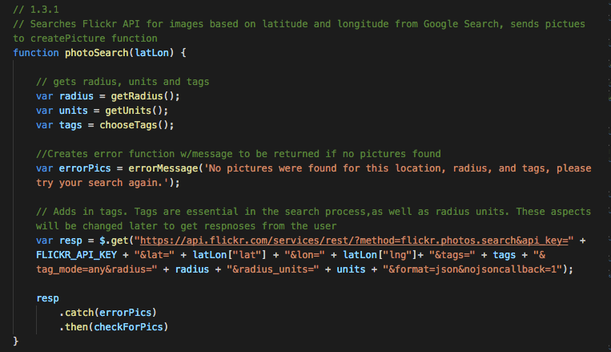
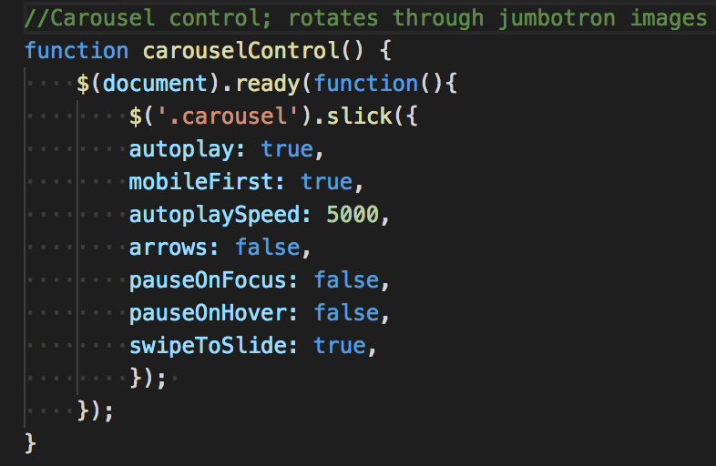
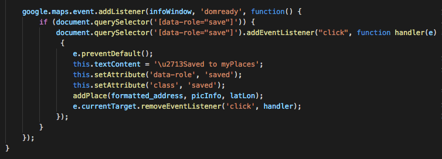

<h1>myPhotoAtlas<h1>

<h2><u>Overview:</u><h2>
<h4>myPhotoAtlas allows users to search and save photos and locations around the world. It is an application that is geared toward photography enthusiasts and travellers exploring a new location. Our final product allows the user to search any location and returns a gallery of photos taken within a specific radius of that location. Additional features include the ability to get directions from Google Maps and save/delete locations and images to the my ‘myPlaces’ page. In the future we would like to incorporate a backend server and database, which will allow the user to login to their own profile. We would also like to import another API which will give the user information on their chosen locations (i.e. wikipedia etc.).</h4>

 

<h2><u>The Team:</u></h2>

<h3>Sarah Abbey: https://github.com/sabbey37</h3>
<b>Primary team role:</b> JavaScript/jQuery Function-writer, prototype/concepting
 
<b>Contributions:</b> JavaScript and jQuery for myPlaces and Search pages. Implemented our streach goal of allowing a user to save places in local storage and displaying those locations on the myPlaces page. Developed jQuery and JavaScript functions to efficently obtain information from Flickr API and Google Maps API, including geocoding and reverse geocoding.

<h3>Katie Lane: https://github.com/MaeDae11</h3>
<b>Primary team role:</b> Front-end markup and styling, prototype/concepting, JavaScript Function-write
 
<b>Contributions:</b> Main focus was HTML, CSS, JavaScript and jQuery for myPlaces and Search pages. Focused our Flickr API search after running into roadblocks. Deployed responsive design while collaborating with team as well as consistent design throughout all pages, navigation, and footers.

<h3>Stephanie Asmar: https://github.com/stephanieasmar</h3>
<b>Primary team role:</b> Front-end markup and styling, prototype/concepting, Scrum/Agile
 
<b>Contributions:</b> HTML, CSS & JavaScript for home and about pages, concepting/prototyping of product idea. Guided overall design and usability. Tested responsive design and implemented changes with team as needed. Ensured consistent design throughout website.

 
 
<h2><u>What we used:</u></h3>
<h3>Languages:</h3>
<ul>
    <li>HTML5</li>
    <li>CSS</li>
    <li>JavaScript</li>
    <li>JSON</li>
</ul>

<h3>Libraries:</h3>
<ul>
    <li>jQuery</li>
</ul

<h3>Frameworks:</h3>
<ul>
    <li>Bootstrap</li>
</ul

<h3>APIs</h3>
<ul>
    <li>Google (GeoCode, Maps)</li>
    <li>Flickr</li>
</ul

<h3>Other:</h3>
<ul>
    <li>Favicon</li>
    <li>AJAX</li>
</ul>

 

<h2><u>MVP (Minimum Viable Product):</u></h2>
<ul>
    <li>Photo search gallery to feature photography across the United States</li>
    <li>Home page with wonderful images implemented with a carousel</li>
    <li>Google map</li>
    <li>Responsive design</li>
</ul>

 

<h2><u>Stretch Goals</u></h2>
<ul>
    <li>Using AJAX / localstorage to save myPlaces</li>
    <li>Map with functionality: info window pop up, locating where picture was taken, marking location on map, displaying multiple markers at a time, adjusting map depending where user was searching</li>
    <li>Implementing Google Autocomplete</li>
    <li>Hiding and showing of map</li>
</ul>

 

<h2><u>Challenges & Solutions:</u><h2>
<h3>Some of the biggest challenges we faced with this project build included:</h2>

<b>Challenge:</b> Finding quality APIs that returned necessary data. Used 3-4 before we settled on the final ones.
 
<b>Solution:</b> Learned much more about APIs. What to look for, how to search, how to retrieve the data we wanted.

<b>Challenge:</b> Understanding Google Maps API, using their language.
 
<b>Solution:</b> Read user documentation.

<b>Challenge:</b> Photo tags, getting good photos from Flickr API
 
<b>Solution:</b> Trial and error, reading up on user documentation, tutorials

 

<h2><u>Code Snippets:</u></h2>

<h4>The code above showcases how we worked with Flickr's API and the specificity they require when working with their database</h4>
 

<h4> Once we found the carousel feature, we knew we wanted it. This snipit shows the simple, yet customizable, carousel that features on our home page.</h4>
 

<h4>This bit of code displays the hide and show features for our map and hamburger menu</h4>
 

<h4>The above code shows how event listerners can be added to text inside a Google Maps marker. The code also detects whether or not the event has already been saved to myPlaces. The listener is not added if the event has been saved.</h4>
 

<h4>The code above demonstrates how a user's places on their myPlaces page are rendered from local storage.</h4>
 

<h2>Screenshots:</h2>

<h4>Highlights the landing page of myPhotoAtlas</h4>
 

<h4>Photo result after Searching New York City</h4>
 

<h4>Displays how myPlaces is layed out</h4>
 

<h4>Showcases our About section and the methods we used in creating myPhotoAtlas</h4>

       
