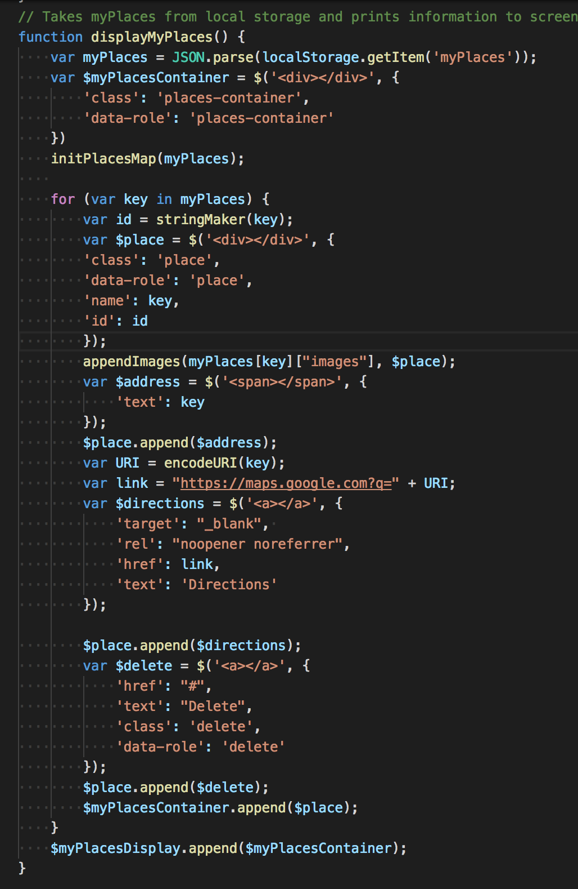
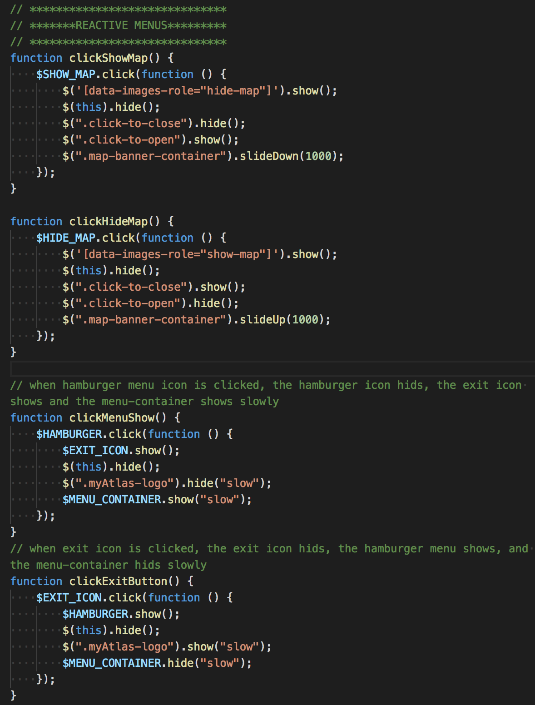
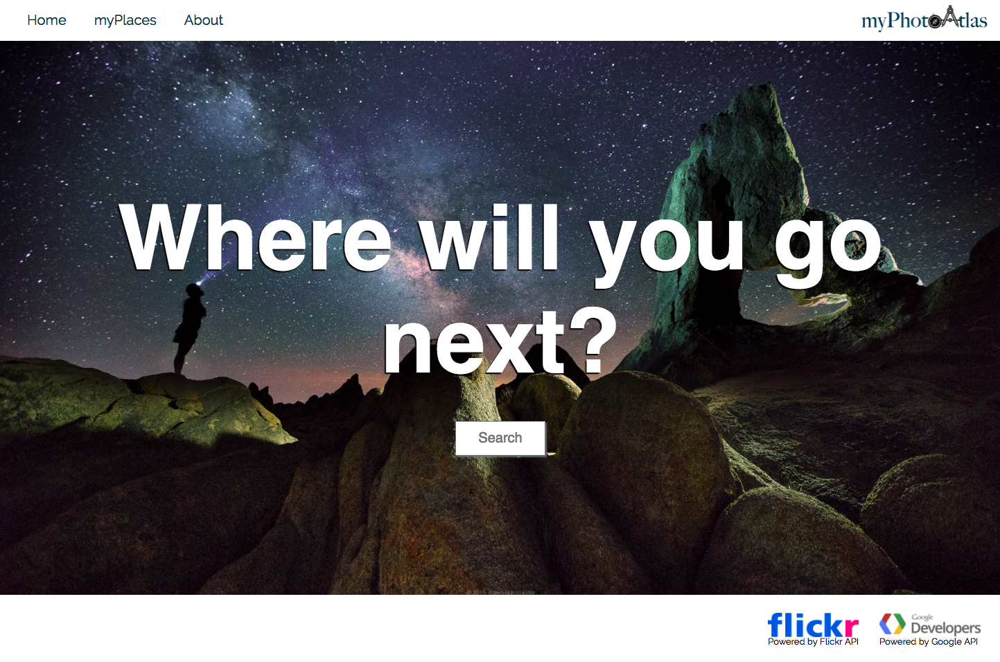
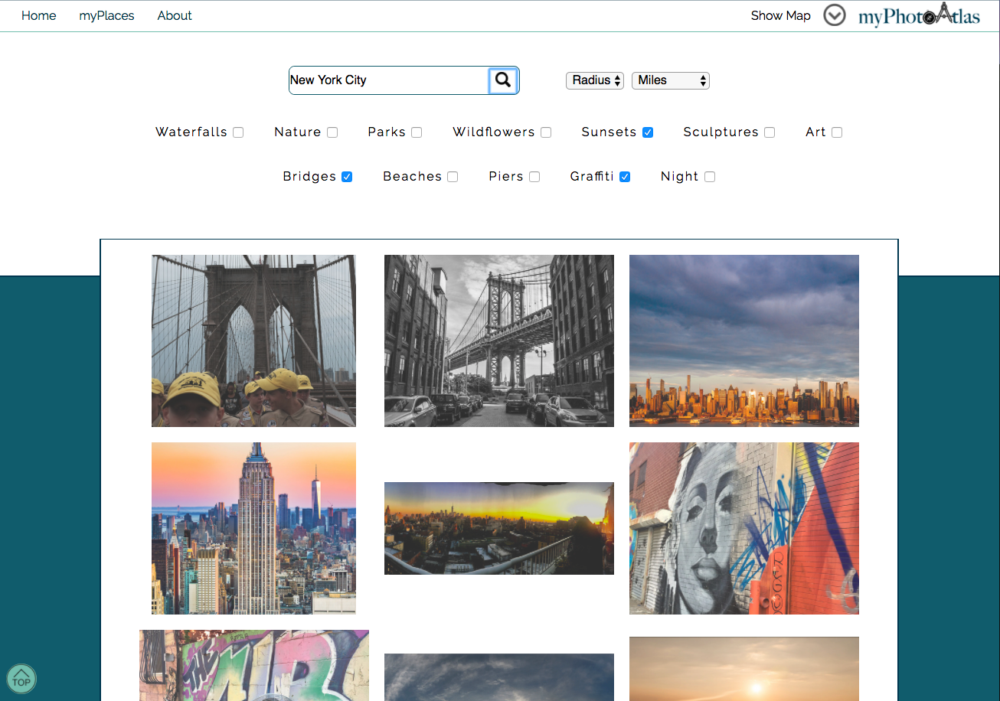
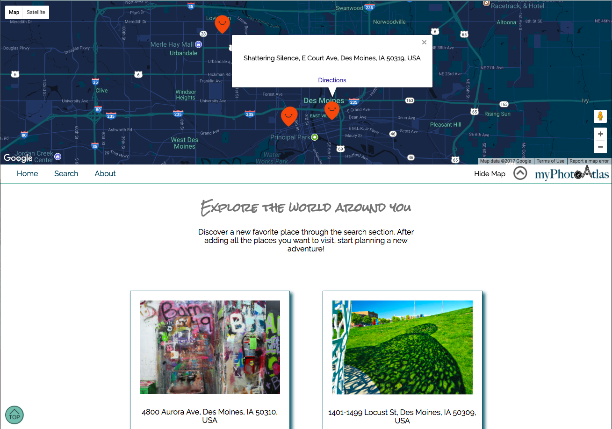
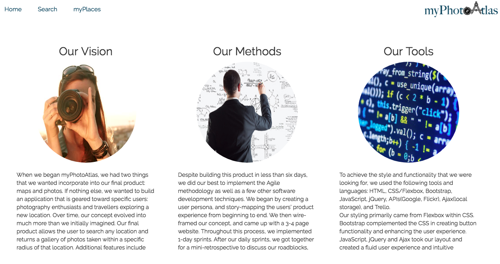

<h1>myPhotoAtlas<h1>

<h2><u>Overview:</u><h2>
<h4>myPhotoAtlas allows users to search and save photos and locations around the world. It is an application that is geared toward photography enthusiasts and travellers exploring a new location. Our final product allows the user to search any location, and returns a gallery of photos taken within a specific radius of that location. Additional features include the ability to get directions and save/delete locations and images to the my ‘myPlaces’ page. In the future we would like to incorporate a backend server and database, which will allow the user to login to their own profile. We would also like to import another API which will give the user information on their chosen locations (i.e. wikipedia etc.).</h4>

 

<h2><u>The Team:</u></h2>

<h3>Sarah Abbey: https://github.com/sabbey37</h3>
<b>Primary team role:</b> Front-end markup and styling, UI/UX, prototype/concept, Scrum, JavaScript/jQuery Function-writer
 
<b>Contributions:</b> HTML, CSS, JavaScript, and jQuery for myPlaces and Search pages. Implemented our streach goal of localstorage for myPlaces. Developed jQuery and JavaScript functions to efficently obtain information from Google Maps API, including geocoding and reverse geocoding.

<h3>Katie Lane: https://github.com/MaeDae11</h3>
<b>Primary team role:</b> Front-end markup and styling, UI/UX, prototype/concept, Scrum Master, JavaScript/jQuery Function-writer
 
<b>Contributions:</b> Main focuse was HTML, CSS, JavaScript and jQuery for myPlaces and Search pages. Focused our Flickr API search after running into roadblocks. Deployed responsive design while collaborating with team, as well as, consistant design throughout all pages navigation and footers.

<h3>Stephanie Asmar: https://github.com/stephanieasmar</h3>
<b>Primary team role:</b> Front-end markup and styling, UI/UX, prototype/concept, Scrum/Agile project management
 
<b>Contributions:</b> HTML, CSS & JavaScript for home and about pages, concepting/prototyping of product idea. Guided overal design and usability. Testing responsive design and implementing changes with team as needed. Ensured consistend design throughtout website.

 
 
<h2><u>What we used:</u></h3>
<h3>Languages:</h3>
<ul>
    <li>HTML5</li>
    <li>CSS</li>
    <li>JavaScript</li>
    <li>JSON</li>
</ul>

<h3>Libraries:</h3>
<ul>
    <li>jQuery</li>
</ul

<h3>Frameworks:</h3>
<ul>
    <li>Bootstrap</li>
</ul

<h3>APIs</h3>
<ul>
    <li>Google (GeoCode, Maps)</li>
    <li>Flickr</li>
</ul

<h3>Other:</h3>
<ul>
    <li>Favicon</li>
    <li>Ajax</li>
</ul>

 

<h2><u>MVP (Minimum Viable Product):</u></h2>
<ul>
    <li>Photo search gallery to feature photography across the United States</li>
    <li>Home page with wonderful images implemented with a carousel</li>
    <li>Google map</li>
    <li>Responsive design</li>
</ul>

 

<h2><u>Stretch Goals</u></h2>
<ul>
    <li>Using Ajax / localstorage to save myPlaces</li>
    <li>Map with functionality: info window pop up, locating where picture was taken, marking location on map, displaying multiple markers at a time, adjusting map depending where user was searching</li>
    <li>Implementing Google Autocomplete</li>
    <li>Hiding and showing of map</li>
</ul>

 

<h2><u>Challenges & Solutions:</u><h2>
<h3>Some of the biggest challenges we faced with this project build included:</h2>

<b>Challenge:</b> Getting API to work, and returned data we wanted. Used 3-4 before we settled on the final ones
 
<b>Solution:</b> Learned a lot more about APIs. What to look for, how to search, how to get data that we were looking for

<b>Challenge:</b> Figuring out Map API, using Googles language
 
<b>Solution:</b> Read user documentation

<b>Challenge:</b> Photo tags, getting good photos from flickr
 
<b>Solution:</b> Trial and error, reading up on user documentation, tutorials

 

<h2><u>Code Snippets:</u></h2>

<h4>The code above showcases how we work with Flickr's API and the specificity they require when working with their database</h4>
 

<h4> Once we found the carousel feature, we knew we wanted it. This snipit shows the simple, yet customizable, carousel that features on our home page.</h4>
 

<h4>This final bit of code displays our method of the hide and show features for our map and hamburger menu</h4>
 

<h2>Screenshots:</h2>

<h4>Highlights the landing page of myPhotoAtlas</h4>
 

<h4>Photo result after Searching New York City</h4>
 

<h4>Displays how myPages is layed out</h4>
 

<h4>Showcases our About section and our group went about myPhotoAtlas</h4>

       
